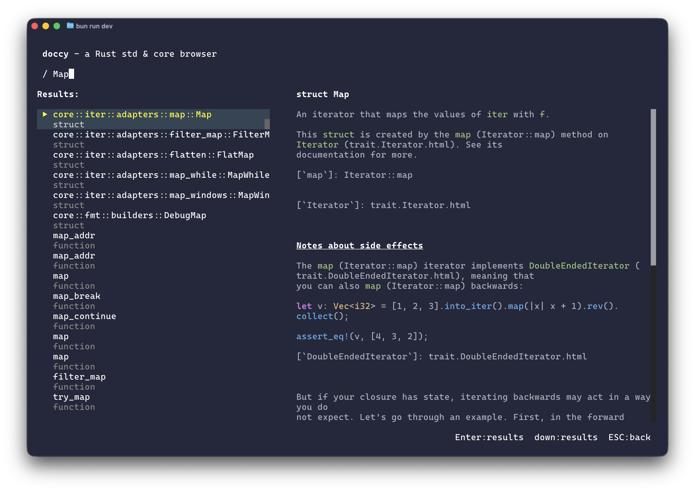

# doccy

A rich TUI to browse Rust's std and core libraries.



## Installation

- (required) If not yet present on your system, install the nightly toolchain of `rustup` as well as the Rustdoc JSON component:

```sh
rustup toolchain install nightly
rustup component add rust-docs-json --toolchain nightly
```

- Use `bun` to install `doccy` locally:

```sh
git clone https://github.com/asuender/doccy.git
cd doccy
bun install
bun run dev
```

## Usage

One of the goals I set for this project is to keep navigation as simple as possible. After startup, your screen should look similar to the demo picture above. The status bar at the bottom indicates the available commands to focus other elements.

## Contributing

Pull requests are welcome. For major changes, please open an issue first to discuss what you would like to change.

## License

MIT
